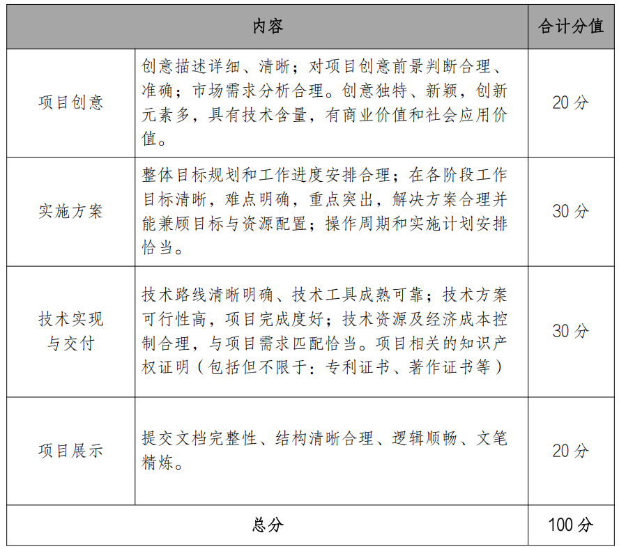
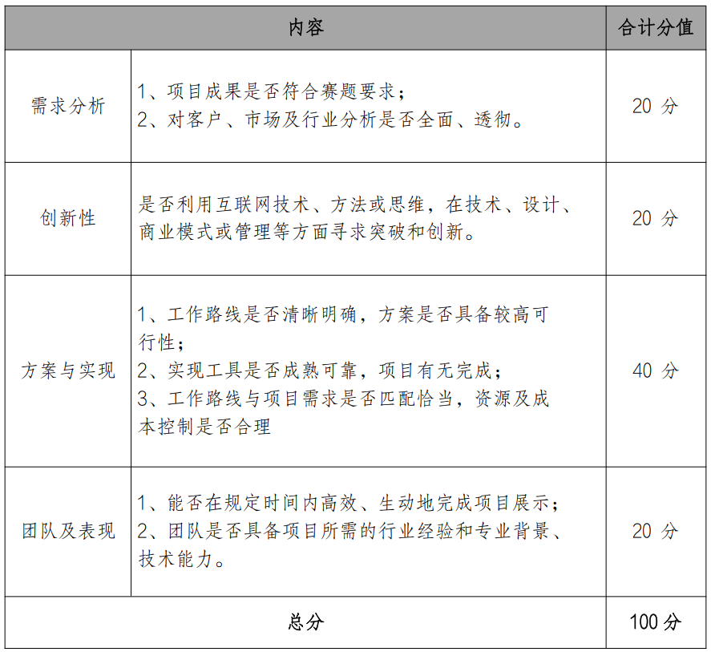

## 1 作品规范

- 产业导向：服务产业
- 技术导向
- 应用导向：创意调查、现实问题

## 2 时间

- 赛题申报：2022-11-21 ~ 2023-3-10
- 初赛阶段：2023-5
  - 队员、导师调整：2023-4-4 ~ 2023-4-7
  - 初赛作品提交：2023-4-11 ~ 2023-4-17
  - 线上审评：2023-4-18 ~ 2023-5-4
  - 区域赛现场答辩：5月中下旬
- 全国赛决赛晋级名单公布：6月中旬
- 全国决赛：7月下旬

## 3 评审原则

服创大赛秉承“创新、 创业、 创富” 的精神， 综合考察参赛团队对竞赛主
题的理解， 对客户及市场的深入分析与把握， 在业务分析、 组织模型、 技术方
案、 可行性分析、 成本考虑、 管理要素等多方面的表现， 而不仅是技术的实
现。
服创大赛尤其关注参赛团队在解决方案和答辩交流过程中体现出的管理能
力、 团队合作能力、 创新能力、 学习能力、 问题解决能力和创业精神等。  

## 4 初赛作品提交

提交内容：

- [ ] 概要介绍（必选）
- [ ] 项目简介PPT（必选）
- [ ] 项目详细方案（必选）
- [ ] 项目演示视频（必选）
- [ ] 项目知识产权证明（可选）
- [ ] 企业要求提交的其他材料

提交方式：

- 登录大赛官网上传： 将所有文件上传至大赛官网指定位置；
- 以参赛团队为单位， 将本队所有提交材料文档打包压缩为 ZIP 文件， 上传百度网盘， 并将分享的链接发送 email 到大赛作品邮箱（ fwwbdszp@fwwb.org.cn） ， 邮件主题注明赛题组别、 参赛院校和作品名称。 ZIP 文件命名规则： “团队编号—团队名称—赛题编号赛题名称” 。  

## 5 评分表

初赛：

决赛：

## 6 相关链接

[赛题答疑论坛](https://mastergo.com/file/77782156635006?utm_source=fwwb&utm_medium=saitish)

## 7 其他

- 及时关注官网动态❗❗❗
- 一定要多和企业命题人交流❗❗❗
