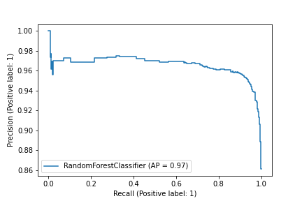
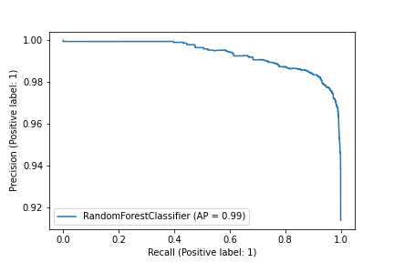

## 1 数据预处理

1. 题目所给数据集简介

| train1.csv | 所有不正常标签：20642个 正常标签：800w左右 | 无前缀无路径 例如：say0000-9.com                         |
| ---------- | ---------------------------------------------- | ------------------------------------------------------------ |
| train2.csv | 不正常标签：7210个                             | 无前缀无路径 例如：www.jwlxx.com                         |
| train3.csv | 不正常标签：430个                              | 有http、https前缀，部分有路径 例如：http://www.56flw.com/info371/ |
| test.csv   | 待分类的测试集：100w左右                       | 无前缀无路径                                                 |

2. 为了获得更多的训练集，我们把 train1.csv、train2.csv、train3.csv中的所有不正常 url合起来，并取样了train1.csv中的部分正常 url，得到【train.csv】：不正常数据（3w左右）+部分正常数据（30w左右）

3. 因为 test 集中所有的 url 前面都没有前缀（ "https://" 或 "http://"）和路径，且 train 中大部分数据也没有，因此我们对 train 中 url 进行处理：删除所有的 "https://" 或 "http://" 前缀，删除后面的路径。

## 2 二分类特征选取

【数据】train.csv：所有不正常数据（3w左右）+部分正常数据（30w左右）。选取训练集数据的 20% 验证。

【结果】都采用 LR 方法进行训练，发现 All Feature 训练效果最好

| 特征选取        | LR训练准确率       | score              | 包含特征                                                     |
| --------------- | ------------------ | ------------------ | ------------------------------------------------------------ |
| Basic Feature   | 0.9444793536804309 | 0.6218333424229776 | 1. 域名中的点数 2. 域名是否包含IP地址 3. 整个域名长度 |
| Lexical Feature | 0.9517953321364453 | 0.7092340702522558 | 1. 域名中的点数 2. 域名的分隔符总数(-, _, ?, =, &) 3. 整个域名长度 4. 连字符总数 5. 是否包含常见顶级域 6. 是否包含一些可疑单词 |
| All Feature     | 0.9559545182525434 | 0.7087068648423699 | 以上所有特征                                                 |

## 3 二分类方法选取

【数据】train.csv：所有不正常数据（3w左右）+部分正常数据（30w左右）

【结果】都选用 all_feature，准确率差不多，但是随机森林的score更高

| 方法选取           | 准确率             | score              |
| ------------------ | ------------------ | ------------------ |
| RandomForest       | 0.9583632555356074 | 0.7327385640807973 |
| LogisticRegression | 0.9559545182525434 | 0.7087068648423699 |

随机森林PR曲线：

逻辑回归PR曲线

## 4 k-means对训练集取样

【数据】① train.csv：所有不正常数据（3w左右）+部分正常数据（30w左右）。选取训练集数据的 20% 验证。

​				② 对所有能打开的、具有ip特征的训练集用k-means聚类取样，并控制不正常url：正常url=1:3。

【结果】都采用 RF 方法进行训练，特征选取 basic+lexical feature，发现正确率和score提高极大。

| 数据选取        | 准确率             | score              |
| --------------- | ------------------ | ------------------ |
| 不用k-means取样 | 0.9583632555356074 | 0.7327385640807973 |
| 用k-means取样   | 0.973819088516415  | 0.9558944341218008 |

随机森林PR曲线：

## 5 添加ip特征

【数据】② 对所有能打开的、具有ip特征的训练集用k-means聚类取样，并控制不正常url：正常url=1:3。

【结果】都采用 RF 方法进行训练，特征分别为 basic+lexical feature和basic+lexical+ip feature，发现正确率和score提高。

| 特征选取         | 准确率            | score              |
| ---------------- | ----------------- | ------------------ |
| basic+lexical    | 0.973819088516415 | 0.9558944341218008 |
| basic+lexical+ip | 0.9825            | 0.9883503179857647 |

随机森林PR曲线：

