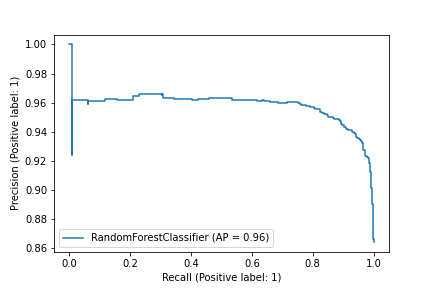

## 1 数据预处理

## 2 二分类特征选取

【数据】train.csv：所有不正常数据（3w左右）+部分正常数据（30w左右）。选取训练集数据的 20% 验证。

【结果】都采用 LR 方法进行训练，发现 All Feature 训练效果最好

| 特征选取        | LR训练准确率 |
| --------------- | ------------ |
| Basic Feature   |              |
| Lexical Feature |              |
| All Feature     |              |

## 3 二分类方法选取

【数据】train.csv：所有不正常数据（3w左右）+部分正常数据（30w左右）

【结果】都选用 all_feature，准确率差不多，但是随机森林的scor

| 方法选取           | 准确率             | score              |
| ------------------ | ------------------ | ------------------ |
| RandomForest       | 0.9583632555356074 | 0.7327385640807973 |
| LogisticRegression | 0.9559545182525434 | 0.7087068648423699 |

随机森林PR曲线：

逻辑回归PR曲线

